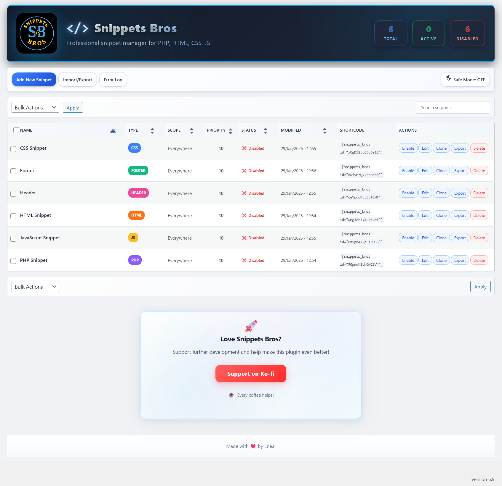

# Snippets Bros
- Professional **WordPress snippet manager** that lets you manage PHP, JavaScript, CSS and HTML from a clean, modern admin UI – without editing theme files.

## Screenshots

<p align="center">
  
</p>

<p align="center">
  <a href="Screenshots/Screenshot-2.png">View Screenshot 2</a> | 
  <a href="Screenshots/Screenshot-3.png">View Screenshot 3</a> | 
  <a href="Screenshots/Screenshot-4.png">View Screenshot 4</a>
</p>

## Features
- Manage snippets by type: **PHP, JS, CSS, HTML, HEADER, FOOTER**.
- Enable/disable, **clone**, categorize and tag snippets.
- Global **Header** and **Footer** code blocks for site-wide injections.
- **Run-once** snippets that automatically disable after first execution.
- Execution priority control per snippet (1-100).
- Detailed **per-snippet error log** and status indicators.
- **Revision history** (up to 15 revisions per snippet).
- Powerful search, filters, categories and tags for organizing snippets.
- Modern, responsive dashboard UI (no custom post types).
- **Keyboard shortcuts** for quick editing and cloning (Ctrl/Cmd + E, Ctrl/Cmd + D).

### Conditional Loading & Locations
- Run snippets:
  - **Everywhere**
  - **Frontend only**
  - **Admin only**
  - **Shortcode only** (`[snippets_bros id="xOxX52x.XXxXx12"]`)
- Advanced conditions:
  - **URL rules**: Multiple URL patterns (one per line), supports contains/exact matching
  - **Multiple locations per snippet** with AND logic (e.g. `/blog` **and** `/contact` **and** `/games`)
  - Basic user rules: logged-in / logged-out
  - Device-style rules (desktop vs mobile targeting)

---

## Security, Safe Mode & Sanitization
Snippets Bros is built with multiple safety layers:
- **Safe Mode toggle**: instantly stop all PHP snippets without deactivating the plugin.
- **Crash shield** logic to help keep the admin accessible if a snippet causes a fatal error.
- **Conflict detection**:
  - Prevents duplicate function, class, interface, trait, and constant declarations
  - Automatically disables conflicting snippets before they cause fatal errors
- **Dangerous PHP protection**:
  - Detects and blocks or warns on functions commonly abused in exploits, such as:
    - `eval`, `assert`, `create_function`, `shell_exec`, `system`, `exec`,
      `passthru`, `popen`, `proc_open`, `base64_decode` patterns, etc.
- **Strict sanitization & escaping**:
  - All titles, descriptions, locations, settings and UI fields are sanitized.
  - Outputs are properly escaped following WordPress coding standards.
- **Capability checks**:
  - Only users with appropriate manage permissions (e.g. administrators) can add, edit or run snippets.

These protections reduce risk, but **cannot make unsafe code safe**. Always test carefully.

---

## Installation
1. Upload the `snippets-bros` plugin folder to `/wp-content/plugins/`.
2. Activate it from **Plugins → Installed Plugins**.
3. Go to **Snippets Bros** in the admin menu and start adding snippets.

> ✅ Tip: Make sure the folder inside `wp-content/plugins/` is named exactly `snippets-bros`.

## Usage

### Basic Snippet Creation
1. Navigate to **Snippets Bros** in your WordPress admin menu
2. Click **Add New Snippet**
3. Choose your snippet type (PHP, JS, CSS, HTML, HEADER, or FOOTER)
4. Add your code in the editor
5. Configure scope and conditions
6. Save and enable

### Using Shortcodes
Add snippets anywhere using shortcodes:
```
[snippets_bros id="xOxX52x.XXxXx12"]
```

### Keyboard Shortcuts
- **Ctrl/Cmd + E**: Quick edit selected snippet
- **Ctrl/Cmd + D**: Clone selected snippet

### Import/Export
- **Export**: Select snippets and use bulk action to export as JSON
- **Import**: Upload JSON files (max 10MB) to import snippets

---

## Frequently Asked Questions

### Will this conflict with other snippet plugins?
You should not use two PHP snippet plugins to run the same code. It is safe to keep other plugins installed, but avoid enabling duplicate snippets in more than one plugin at the same time.

### Can I break my site with a PHP snippet?
Snippets Bros validates code and has a Safe Mode toggle plus an error log, but it is still possible to create fatal errors. Always test new snippets carefully and enable Safe Mode if you need to quickly stop all execution.

### Does it work with block themes and page builders?
Yes. Snippets run at WordPress level and work with classic themes, block themes and page builders.

### Can I export snippets from one site and import into another?
Yes, use the built-in export tool to generate a JSON file and import it on another site. The plugin checks the file type, size and content before importing.

### What happens when I deactivate the plugin?
Safe Mode is automatically enabled and all snippets are disabled to prevent any issues when the plugin is deactivated.

---

## Emergency Recovery

If a snippet crashes your site, you can access the emergency recovery mode:
1. Add `?snippets_bros_emergency=1` to your admin URL
2. This will enable Safe Mode and disable all snippets
3. You can then safely edit or delete the problematic snippet

---

## Support / Donate
If you find Snippets Bros useful, you can support development here:  
👉 https://ko-fi.com/W7W51P4XY6

## Contributing
Contributions are welcome! Please feel free to submit a Pull Request.

## Author
Made with ❤️ by **Enea**
- GitHub: [@EneaCodes](https://github.com/EneaCodes)
- Plugin Repository: [Snippets Bros](https://github.com/EneaCodes/Snippets-Bros)

## License
Released under the GPL v2 license or later.

---

## Changelog

### 1.0.0
* Initial public release
* Multiple URL patterns per snippet (one per line)
* Enhanced validation and sanitization for PHP, JS, CSS and HTML snippets
* Safe Mode switch and visual error indicators
* Import/export with size limits and security checks
* Revision history (15 revisions per snippet), bulk actions and shortcode support
* Conflict detection for functions, classes, interfaces, traits, and constants
* Modern admin interface with keyboard shortcuts
* Ko-fi support panel
